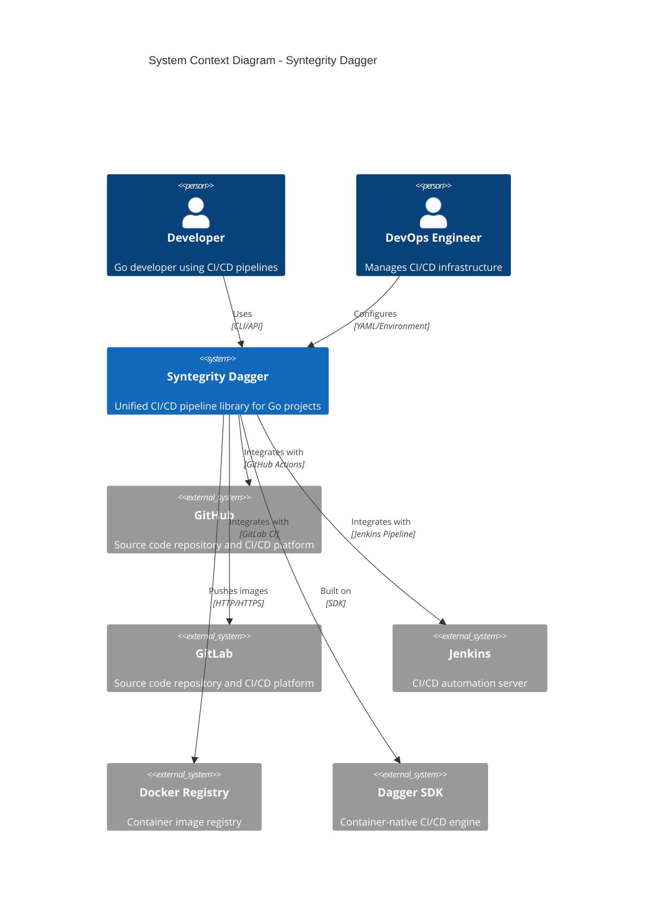
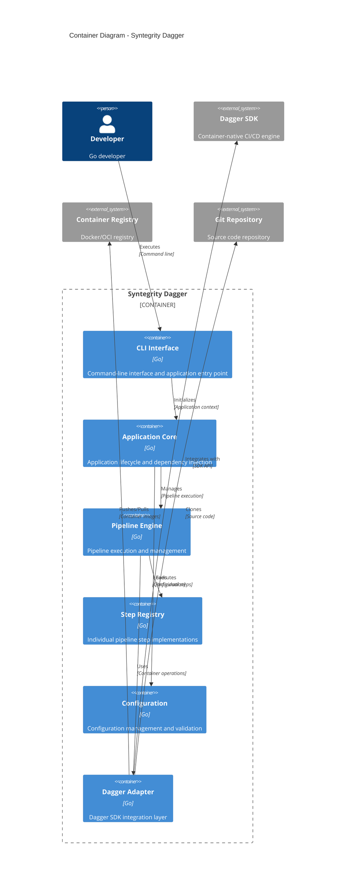
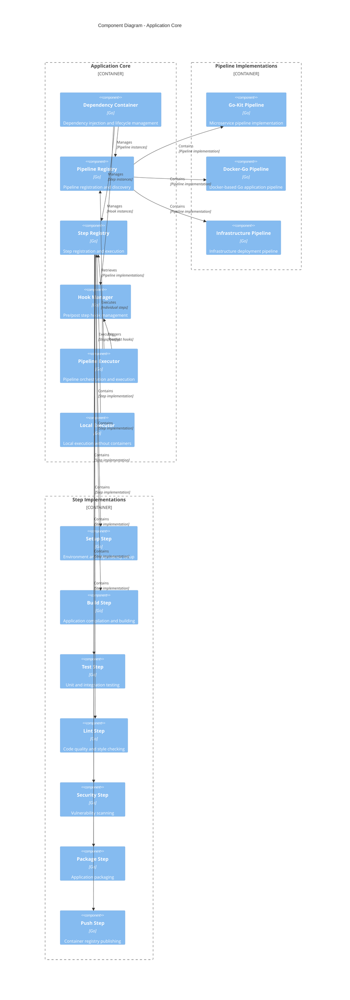
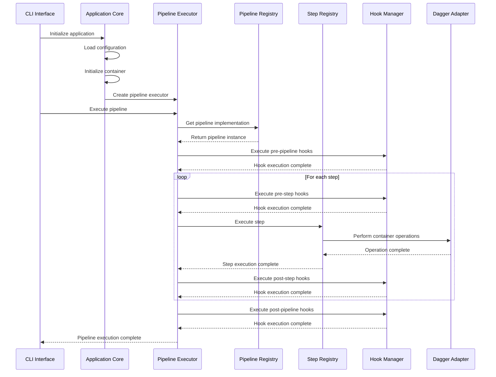
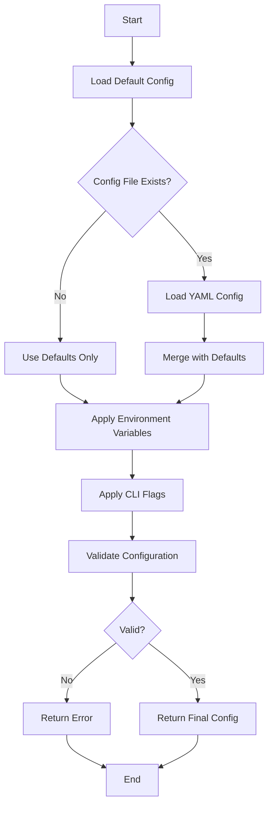

# Syntegrity Dagger Architecture

This document provides a comprehensive overview of the Syntegrity Dagger architecture, including system design, component interactions, and deployment patterns.

## System Overview

Syntegrity Dagger is a unified CI/CD pipeline library that provides standardized, reusable pipelines for Go projects. It's built on top of the Dagger SDK and follows a modular, extensible architecture.

## C4 Model Diagrams

### Level 1: System Context

### Level 2: Container Diagram

### Level 3: Component Diagram

## Architecture Principles

### 1. Modular Design
The system is built with clear separation of concerns:
- **Application Layer**: CLI interface and application lifecycle
- **Pipeline Layer**: Pipeline implementations and orchestration
- **Step Layer**: Individual pipeline step implementations
- **Infrastructure Layer**: Dagger integration and container management

### 2. Dependency Injection
Uses a container-based dependency injection pattern for:
- Component lifecycle management
- Lazy initialization
- Testability and mocking
- Configuration management

### 3. Plugin Architecture
Extensible design allows for:
- Custom pipeline implementations
- Custom step implementations
- Hook system for pre/post processing
- Configuration extensions

### 4. Configuration Management
Multi-layered configuration system:
- Default configuration
- YAML configuration files
- Environment variable overrides
- Command-line flag overrides

## Core Components

### Application Core (`internal/app/`)

#### Container (`container.go`)
- Manages dependency injection
- Handles component lifecycle
- Provides singleton pattern for global components
- Supports lazy initialization

#### Pipeline Executor (`pipeline_executor.go`)
- Orchestrates pipeline execution
- Manages step dependencies
- Handles error propagation
- Supports parallel execution

#### Step Registry (`step_registry.go`)
- Registers and manages pipeline steps
- Provides step discovery
- Handles step execution
- Supports step dependencies

#### Hook Manager (`hook_manager.go`)
- Manages pre/post step hooks
- Supports conditional hook execution
- Handles hook error propagation
- Provides hook lifecycle management

### Pipeline Implementations (`internal/pipelines/`)

#### Go-Kit Pipeline (`go-kit/pipeline.go`)
Optimized for microservices:
- Repository cloning with SSH/HTTPS support
- Dependency management
- Unit testing with coverage reporting
- Docker image building
- Container registry publishing

#### Docker-Go Pipeline (`docker-go/pipeline.go`)
Standard Go application pipeline:
- Multi-stage Docker builds
- Cross-platform compilation
- Container optimization
- Health checks and validation

#### Infrastructure Pipeline (`infra/pipeline.go`)
Infrastructure automation:
- Terraform validation
- Infrastructure testing
- Deployment automation
- Environment management

### Step Implementations (`internal/app/step_handlers.go`)

#### Setup Step
- Environment preparation
- Dependency installation
- Configuration validation
- Workspace setup

#### Build Step
- Application compilation
- Asset bundling
- Binary optimization
- Cross-platform builds

#### Test Step
- Unit test execution
- Integration testing
- Coverage reporting
- Test result aggregation

#### Lint Step
- Code quality checks
- Style enforcement
- Security scanning
- Documentation validation

#### Security Step
- Vulnerability scanning
- Dependency audit
- Security policy enforcement
- Compliance checking

#### Package Step
- Application packaging
- Container image creation
- Artifact generation
- Metadata management

#### Push Step
- Container registry publishing
- Artifact distribution
- Release management
- Deployment triggers

## Data Flow

### Pipeline Execution Flow

### Configuration Resolution Flow

## Deployment Patterns

### Standalone Binary
- Single executable with all dependencies
- No external runtime requirements
- Cross-platform compatibility
- Easy distribution and installation

### Container-Based Execution
- Uses Dagger SDK for container operations
- Isolated execution environments
- Consistent build environments
- Scalable execution

### CI/CD Integration
- GitHub Actions integration
- GitLab CI integration
- Jenkins pipeline support
- Custom CI/CD platform support

## Security Considerations

### Container Security
- Non-root container execution
- Minimal base images
- Security scanning integration
- Vulnerability management

### Configuration Security
- Sensitive data encryption
- Environment variable protection
- Secure credential management
- Audit logging

### Network Security
- TLS/SSL for all communications
- Certificate validation
- Network isolation
- Firewall compliance

## Performance Characteristics

### Execution Performance
- Parallel step execution
- Container caching
- Incremental builds
- Resource optimization

### Scalability
- Horizontal scaling support
- Resource pooling
- Load balancing
- Auto-scaling capabilities

### Monitoring and Observability
- Structured logging
- Metrics collection
- Distributed tracing
- Health checks

## Extension Points

### Custom Pipelines
Developers can create custom pipeline implementations by:
1. Implementing the `Pipeline` interface
2. Registering with the pipeline registry
3. Configuring pipeline-specific options
4. Adding custom steps and hooks

### Custom Steps
New pipeline steps can be added by:
1. Implementing the `StepHandler` interface
2. Registering with the step registry
3. Defining step dependencies
4. Adding configuration options

### Custom Hooks
Pre/post processing can be added by:
1. Implementing hook functions
2. Registering with the hook manager
3. Defining hook conditions
4. Managing hook lifecycle

## Testing Strategy

### Unit Testing
- Component-level testing
- Mock-based testing
- Interface-based testing
- Coverage reporting

### Integration Testing
- End-to-end pipeline testing
- Container integration testing
- Configuration testing
- Error handling testing

### Performance Testing
- Load testing
- Stress testing
- Resource utilization testing
- Scalability testing

## Future Considerations

### Planned Enhancements
- Multi-language support
- Kubernetes integration
- Advanced security features
- Pipeline visualization
- Plugin marketplace

### Architectural Evolution
- Microservices architecture
- Event-driven design
- Cloud-native patterns
- Service mesh integration
