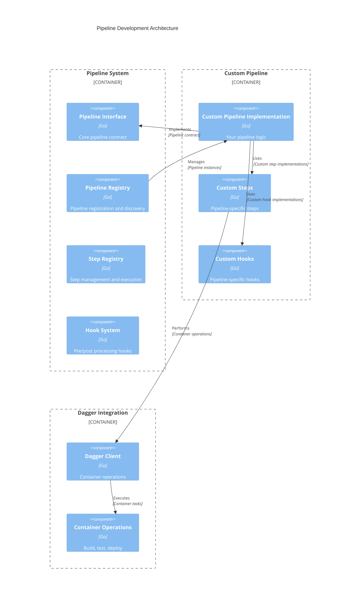

# Pipeline Development Guide

This guide explains how to create custom pipelines for Syntegrity Dagger, including pipeline implementation, step development, and integration patterns.

## Pipeline Architecture Overview



## Creating a Custom Pipeline

### 1. Pipeline Interface Implementation

First, implement the core `Pipeline` interface:

```go
package mypipeline

import (
    "context"
    "fmt"
    
    "dagger.io/dagger"
    "github.com/getsyntegrity/syntegrity-dagger/internal/pipelines"
    "github.com/getsyntegrity/syntegrity-dagger/internal/pipelines/shared"
)

// MyPipeline represents a custom pipeline implementation
type MyPipeline struct {
    Client pipelines.DaggerClient
    Config pipelines.Config
    Src    pipelines.DaggerDirectory
    Cloner shared.Cloner
}

// New creates a new instance of MyPipeline
func New(client *dagger.Client, cfg pipelines.Config) pipelines.Pipeline {
    var daggerClient pipelines.DaggerClient
    var src pipelines.DaggerDirectory
    var cloner shared.Cloner

    if client != nil {
        daggerClient = pipelines.NewDaggerAdapter(client)
        src = daggerClient.Host().Directory(".", pipelines.DaggerHostDirectoryOpts{
            Exclude: []string{"**/node_modules", "**/.git", "**/.dagger-cache"},
        })

        if cfg.GitProtocol == "ssh" {
            cloner = &shared.SSHCloner{}
        } else {
            cloner = &shared.HTTPSCloner{}
        }
    }

    return &MyPipeline{
        Client: daggerClient,
        Config: cfg,
        Src:    src,
        Cloner: cloner,
    }
}

// Name returns the pipeline name
func (p *MyPipeline) Name() string {
    return "my-custom-pipeline"
}

// Setup performs initial setup
func (p *MyPipeline) Setup(ctx context.Context) error {
    // Implement setup logic
    return nil
}

// Build compiles the application
func (p *MyPipeline) Build(ctx context.Context) error {
    // Implement build logic
    return nil
}

// Test runs the test suite
func (p *MyPipeline) Test(ctx context.Context) error {
    // Implement test logic
    return nil
}

// Package creates distributable packages
func (p *MyPipeline) Package(ctx context.Context) error {
    // Implement packaging logic
    return nil
}

// Tag applies version tags
func (p *MyPipeline) Tag(ctx context.Context) error {
    // Implement tagging logic
    return nil
}

// Push uploads artifacts
func (p *MyPipeline) Push(ctx context.Context) error {
    // Implement push logic
    return nil
}

// BeforeStep returns a hook function to execute before a step
func (p *MyPipeline) BeforeStep(ctx context.Context, step string) pipelines.HookFunc {
    return func(ctx context.Context) error {
        // Implement pre-step logic
        return nil
    }
}

// AfterStep returns a hook function to execute after a step
func (p *MyPipeline) AfterStep(ctx context.Context, step string) pipelines.HookFunc {
    return func(ctx context.Context) error {
        // Implement post-step logic
        return nil
    }
}
```

### 2. Pipeline Registration

Register your pipeline in the application container:

```go
// In internal/app/container.go, add to registerPipelineComponents()

func (c *Container) registerPipelineComponents() {
    c.Register("pipelineRegistry", func() (any, error) {
        registry := NewPipelineRegistry()

        // Register default pipelines
        registry.Register("go-kit", NewGoKitPipeline)
        registry.Register("docker-go", NewDockerGoPipeline)
        registry.Register("infra", NewInfraPipeline)
        
        // Register your custom pipeline
        registry.Register("my-custom", mypipeline.New)

        return registry, nil
    })
}
```

## Creating Custom Steps

### 1. Step Handler Implementation

```go
package mysteps

import (
    "context"
    "fmt"
    
    "dagger.io/dagger"
    "github.com/getsyntegrity/syntegrity-dagger/internal/interfaces"
)

// MyCustomStepHandler implements a custom pipeline step
type MyCustomStepHandler struct {
    config interfaces.Configuration
    client *dagger.Client
    logger interfaces.Logger
}

// NewMyCustomStepHandler creates a new step handler
func NewMyCustomStepHandler(
    config interfaces.Configuration,
    client *dagger.Client,
    logger interfaces.Logger,
) interfaces.StepHandler {
    return &MyCustomStepHandler{
        config: config,
        client: client,
        logger: logger,
    }
}

// Execute runs the custom step
func (h *MyCustomStepHandler) Execute(ctx context.Context) error {
    h.logger.Info("Executing custom step")
    
    // Implement your custom logic here
    // Example: Run a custom build process
    
    if h.client != nil {
        // Use Dagger client for container operations
        container := h.client.Container().
            From("golang:1.25.1-alpine").
            WithMountedDirectory("/src", h.client.Host().Directory(".")).
            WithWorkdir("/src").
            WithExec([]string{"go", "build", "-o", "myapp", "./cmd/myapp"})
        
        // Export the built binary
        _, err := container.File("/src/myapp").Export(ctx, "./myapp")
        if err != nil {
            return fmt.Errorf("failed to export binary: %w", err)
        }
    }
    
    h.logger.Info("Custom step completed successfully")
    return nil
}

// GetStepInfo returns information about the step
func (h *MyCustomStepHandler) GetStepInfo() interfaces.StepInfo {
    return interfaces.StepInfo{
        Name:        "my-custom-step",
        Description: "Custom step for specialized processing",
        Dependencies: []string{"setup"},
        Timeout:     10 * time.Minute,
    }
}

// Validate checks if the step can be executed
func (h *MyCustomStepHandler) Validate(ctx context.Context) error {
    // Implement validation logic
    return nil
}
```

### 2. Step Registration

Register your custom step:

```go
// In internal/app/container.go, add to registerStepComponents()

func (c *Container) registerStepComponents() {
    c.Register("stepRegistry", func() (any, error) {
        registry := NewStepRegistry()

        // Get logger and dagger client
        logger, err := c.Get("logger")
        if err != nil {
            return nil, fmt.Errorf("failed to get logger: %w", err)
        }
        log := logger.(*LoggerAdapter)

        client, err := c.Get("daggerClient")
        if err != nil {
            client = nil
        }
        var daggerClient *dagger.Client
        if client != nil {
            daggerClient = client.(*dagger.Client)
        }

        // Register default steps
        _ = registry.RegisterStep("setup", NewSetupStepHandler(c.config, daggerClient, log))
        _ = registry.RegisterStep("build", NewBuildStepHandler(c.config, daggerClient, log))
        _ = registry.RegisterStep("test", NewTestStepHandler(c.config, daggerClient, log))
        // ... other default steps
        
        // Register your custom step
        _ = registry.RegisterStep("my-custom-step", mysteps.NewMyCustomStepHandler(c.config, daggerClient, log))

        return registry, nil
    })
}
```

## Hook System

### 1. Custom Hook Implementation

```go
package myhooks

import (
    "context"
    "fmt"
    
    "github.com/getsyntegrity/syntegrity-dagger/internal/interfaces"
)

// MyCustomHook implements custom pre/post processing
type MyCustomHook struct {
    config interfaces.Configuration
    logger interfaces.Logger
}

// NewMyCustomHook creates a new hook
func NewMyCustomHook(config interfaces.Configuration, logger interfaces.Logger) *MyCustomHook {
    return &MyCustomHook{
        config: config,
        logger: logger,
    }
}

// Execute runs the hook logic
func (h *MyCustomHook) Execute(ctx context.Context) error {
    h.logger.Info("Executing custom hook")
    
    // Implement your hook logic
    // Example: Send notifications, update status, etc.
    
    return nil
}

// ShouldExecute determines if the hook should run
func (h *MyCustomHook) ShouldExecute(ctx context.Context, step string) bool {
    // Implement conditional logic
    return true
}
```

### 2. Hook Registration

```go
// In your pipeline implementation, register hooks

func (p *MyPipeline) BeforeStep(ctx context.Context, step string) pipelines.HookFunc {
    return func(ctx context.Context) error {
        hook := myhooks.NewMyCustomHook(p.Config, p.logger)
        if hook.ShouldExecute(ctx, step) {
            return hook.Execute(ctx)
        }
        return nil
    }
}
```

## Configuration Management

### 1. Custom Configuration Options

```go
// Define custom configuration keys
const (
    MyCustomOptionKey = "my.custom.option"
    MyCustomTimeoutKey = "my.custom.timeout"
)

// In your pipeline, access custom configuration
func (p *MyPipeline) Build(ctx context.Context) error {
    customOption := p.Config.GetString(MyCustomOptionKey)
    timeout := p.Config.GetDuration(MyCustomTimeoutKey)
    
    // Use configuration values
    return nil
}
```

### 2. Configuration Validation

```go
// Add validation for custom options
func (p *MyPipeline) ValidateConfig() error {
    if p.Config.GetString(MyCustomOptionKey) == "" {
        return fmt.Errorf("my.custom.option is required")
    }
    
    timeout := p.Config.GetDuration(MyCustomTimeoutKey)
    if timeout <= 0 {
        return fmt.Errorf("my.custom.timeout must be positive")
    }
    
    return nil
}
```

## Testing Custom Pipelines

### 1. Unit Testing

```go
package mypipeline_test

import (
    "context"
    "testing"
    
    "github.com/stretchr/testify/assert"
    "github.com/stretchr/testify/require"
    "github.com/getsyntegrity/syntegrity-dagger/internal/pipelines"
    "github.com/getsyntegrity/syntegrity-dagger/mocks"
)

func TestMyPipeline_Name(t *testing.T) {
    pipeline := mypipeline.New(nil, pipelines.Config{})
    assert.Equal(t, "my-custom-pipeline", pipeline.Name())
}

func TestMyPipeline_Setup(t *testing.T) {
    // Create mock configuration
    mockConfig := &mocks.MockConfiguration{}
    mockConfig.On("GetString", "git.protocol").Return("https")
    
    pipeline := mypipeline.New(nil, mockConfig)
    
    err := pipeline.Setup(context.Background())
    require.NoError(t, err)
}
```

### 2. Integration Testing

```go
func TestMyPipeline_Integration(t *testing.T) {
    if testing.Short() {
        t.Skip("Skipping integration test")
    }
    
    // Set up test environment
    ctx := context.Background()
    
    // Create Dagger client
    client, err := dagger.Connect(ctx, dagger.WithLogOutput(os.Stdout))
    require.NoError(t, err)
    defer client.Close()
    
    // Create test configuration
    config := pipelines.Config{
        GitProtocol: "https",
        // ... other config options
    }
    
    // Create pipeline
    pipeline := mypipeline.New(client, config)
    
    // Test pipeline execution
    err = pipeline.Setup(ctx)
    require.NoError(t, err)
    
    err = pipeline.Build(ctx)
    require.NoError(t, err)
    
    err = pipeline.Test(ctx)
    require.NoError(t, err)
}
```

## Best Practices

### 1. Error Handling

```go
func (p *MyPipeline) Build(ctx context.Context) error {
    // Use context for cancellation
    select {
    case <-ctx.Done():
        return ctx.Err()
    default:
    }
    
    // Wrap errors with context
    if err := p.performBuild(ctx); err != nil {
        return fmt.Errorf("build failed: %w", err)
    }
    
    return nil
}
```

### 2. Logging

```go
func (p *MyPipeline) Build(ctx context.Context) error {
    p.logger.Info("Starting build process", 
        "pipeline", p.Name(),
        "config", p.Config)
    
    // ... build logic ...
    
    p.logger.Info("Build completed successfully",
        "duration", time.Since(start))
    
    return nil
}
```

### 3. Resource Management

```go
func (p *MyPipeline) Build(ctx context.Context) error {
    // Use defer for cleanup
    defer func() {
        if p.tempDir != "" {
            os.RemoveAll(p.tempDir)
        }
    }()
    
    // ... build logic ...
    
    return nil
}
```

### 4. Configuration Validation

```go
func (p *MyPipeline) ValidateConfig() error {
    required := []string{
        "git.url",
        "registry.url",
    }
    
    for _, key := range required {
        if p.Config.GetString(key) == "" {
            return fmt.Errorf("required configuration missing: %s", key)
        }
    }
    
    return nil
}
```

## Example: Complete Custom Pipeline

Here's a complete example of a custom pipeline for a Node.js application:

```go
package nodepipeline

import (
    "context"
    "fmt"
    
    "dagger.io/dagger"
    "github.com/getsyntegrity/syntegrity-dagger/internal/pipelines"
    "github.com/getsyntegrity/syntegrity-dagger/internal/pipelines/shared"
)

// NodePipeline implements a pipeline for Node.js applications
type NodePipeline struct {
    Client pipelines.DaggerClient
    Config pipelines.Config
    Src    pipelines.DaggerDirectory
    Cloner shared.Cloner
}

// New creates a new Node.js pipeline
func New(client *dagger.Client, cfg pipelines.Config) pipelines.Pipeline {
    var daggerClient pipelines.DaggerClient
    var src pipelines.DaggerDirectory
    var cloner shared.Cloner

    if client != nil {
        daggerClient = pipelines.NewDaggerAdapter(client)
        src = daggerClient.Host().Directory(".", pipelines.DaggerHostDirectoryOpts{
            Exclude: []string{"**/node_modules", "**/.git", "**/.dagger-cache"},
        })

        if cfg.GitProtocol == "ssh" {
            cloner = &shared.SSHCloner{}
        } else {
            cloner = &shared.HTTPSCloner{}
        }
    }

    return &NodePipeline{
        Client: daggerClient,
        Config: cfg,
        Src:    src,
        Cloner: cloner,
    }
}

func (p *NodePipeline) Name() string {
    return "node"
}

func (p *NodePipeline) Setup(ctx context.Context) error {
    // Install dependencies
    container := p.Client.Container().
        From("node:18-alpine").
        WithMountedDirectory("/src", p.Src).
        WithWorkdir("/src").
        WithExec([]string{"npm", "ci"})
    
    // Cache node_modules
    _, err := container.Directory("/src/node_modules").Export(ctx, "./node_modules")
    return err
}

func (p *NodePipeline) Build(ctx context.Context) error {
    // Build the application
    container := p.Client.Container().
        From("node:18-alpine").
        WithMountedDirectory("/src", p.Src).
        WithWorkdir("/src").
        WithExec([]string{"npm", "run", "build"})
    
    // Export build artifacts
    _, err := container.Directory("/src/dist").Export(ctx, "./dist")
    return err
}

func (p *NodePipeline) Test(ctx context.Context) error {
    // Run tests
    container := p.Client.Container().
        From("node:18-alpine").
        WithMountedDirectory("/src", p.Src).
        WithWorkdir("/src").
        WithExec([]string{"npm", "test"})
    
    // Export test results
    _, err := container.Directory("/src/coverage").Export(ctx, "./coverage")
    return err
}

func (p *NodePipeline) Package(ctx context.Context) error {
    // Create Docker image
    container := p.Client.Container().
        From("node:18-alpine").
        WithMountedDirectory("/src", p.Src).
        WithWorkdir("/src").
        WithExec([]string{"npm", "ci", "--only=production"})
    
    // Tag the image
    return p.Tag(ctx)
}

func (p *NodePipeline) Tag(ctx context.Context) error {
    // Implement tagging logic
    return nil
}

func (p *NodePipeline) Push(ctx context.Context) error {
    // Push to registry
    return nil
}

func (p *NodePipeline) BeforeStep(ctx context.Context, step string) pipelines.HookFunc {
    return func(ctx context.Context) error {
        // Pre-step logic
        return nil
    }
}

func (p *NodePipeline) AfterStep(ctx context.Context, step string) pipelines.HookFunc {
    return func(ctx context.Context) error {
        // Post-step logic
        return nil
    }
}
```

## Troubleshooting

### Common Issues

1. **Pipeline not found**: Ensure your pipeline is registered in the container
2. **Step execution fails**: Check step dependencies and configuration
3. **Dagger client issues**: Verify Dagger SDK compatibility
4. **Configuration errors**: Validate all required configuration options

### Debugging Tips

1. Enable verbose logging: `--verbose`
2. Use local execution: `--local`
3. Execute single steps: `--step <step-name>`
4. Check configuration: `--config <config-file>`

### Performance Optimization

1. Use container caching
2. Implement parallel step execution
3. Optimize Docker layers
4. Use multi-stage builds
5. Implement incremental builds
