# Workflow Diagrams

This document contains Mermaid diagrams that illustrate the various workflows and processes in Syntegrity Dagger.

## Pipeline Execution Flow

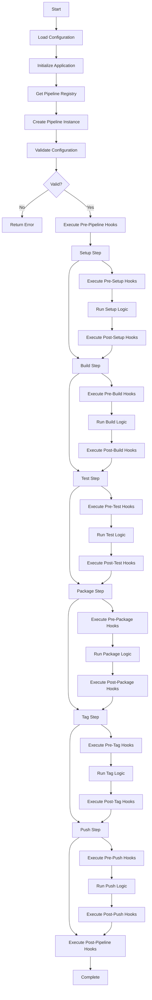

## Configuration Resolution Flow

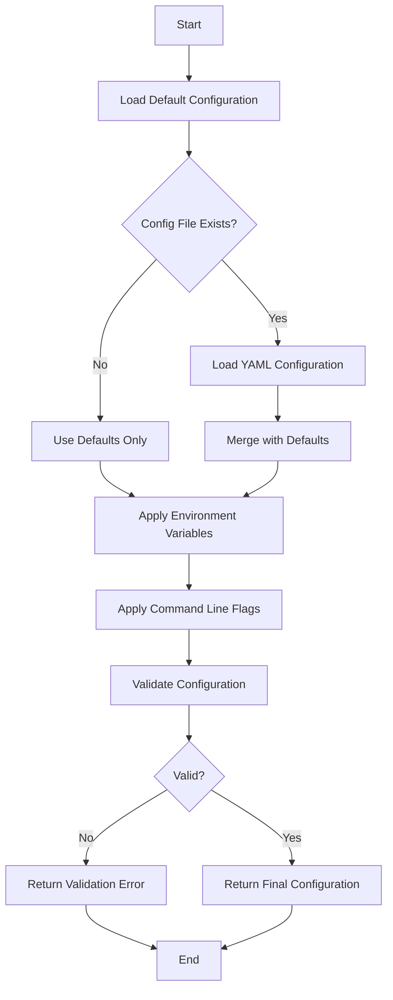

## Step Execution Flow

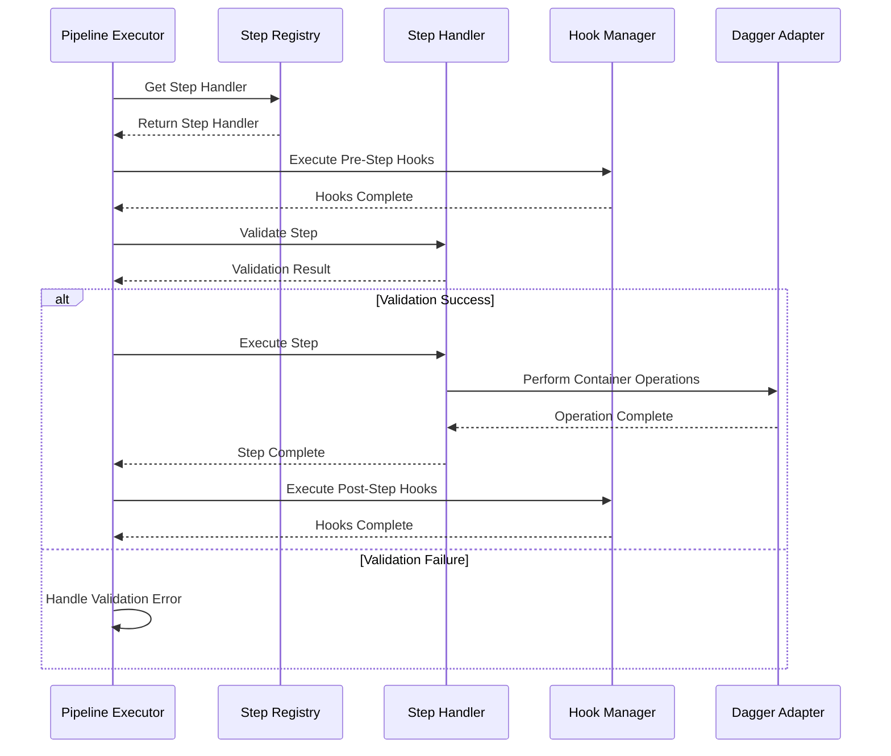

## Container Lifecycle

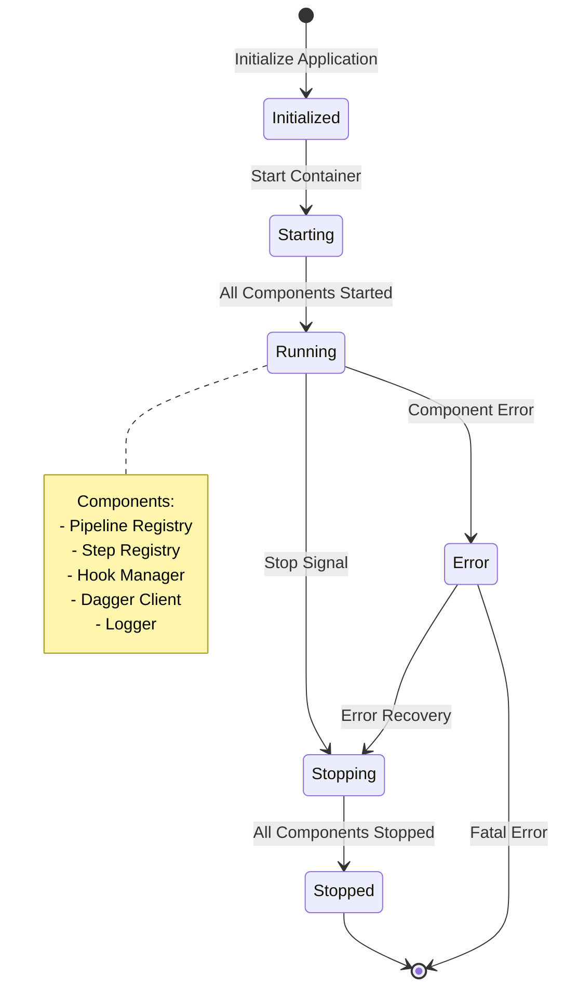

## Pipeline Registry Flow

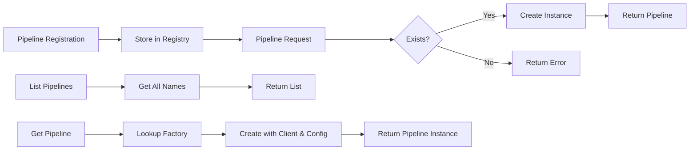

## Error Handling Flow

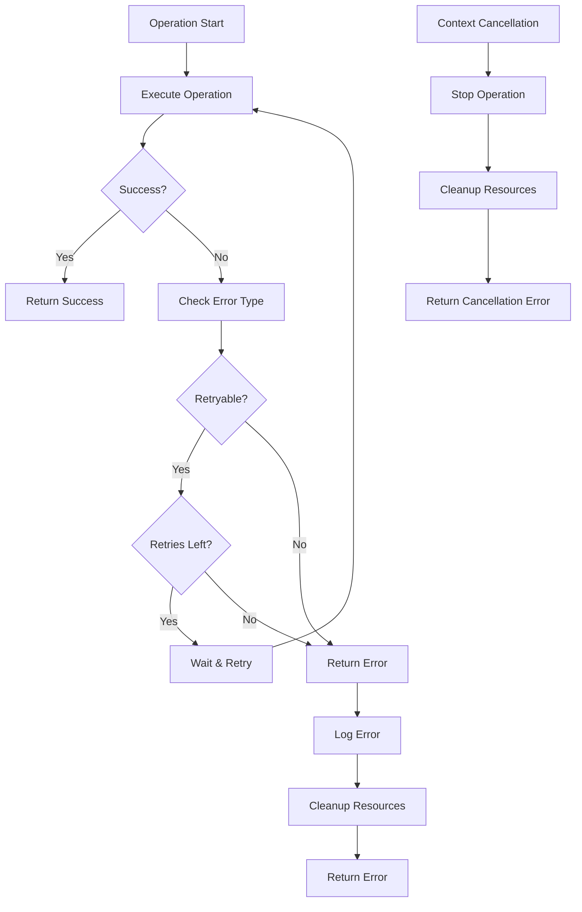

## Security Scanning Flow

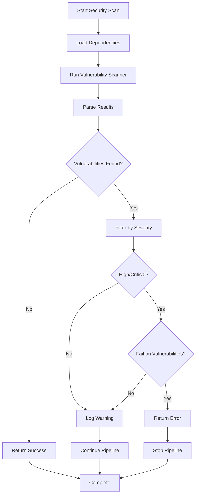

## Build Process Flow

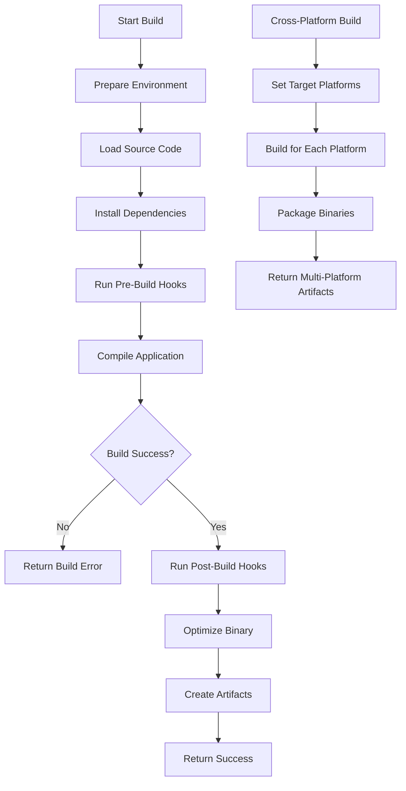

## Test Execution Flow

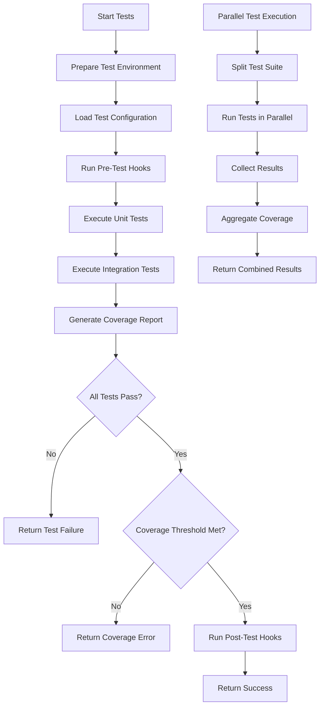

## Deployment Flow

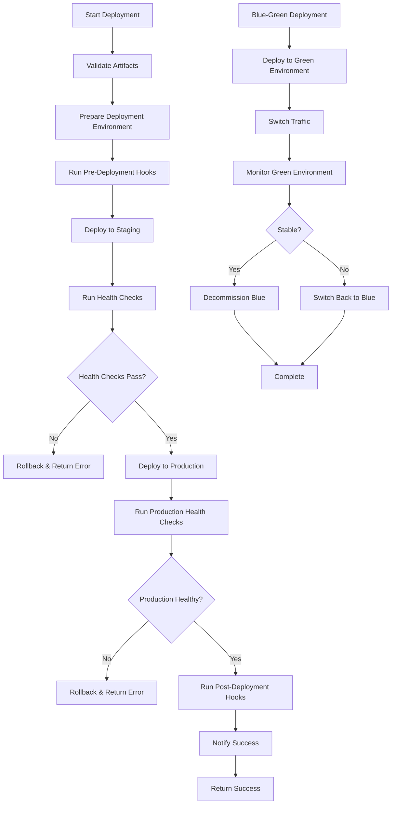

## Notification Flow

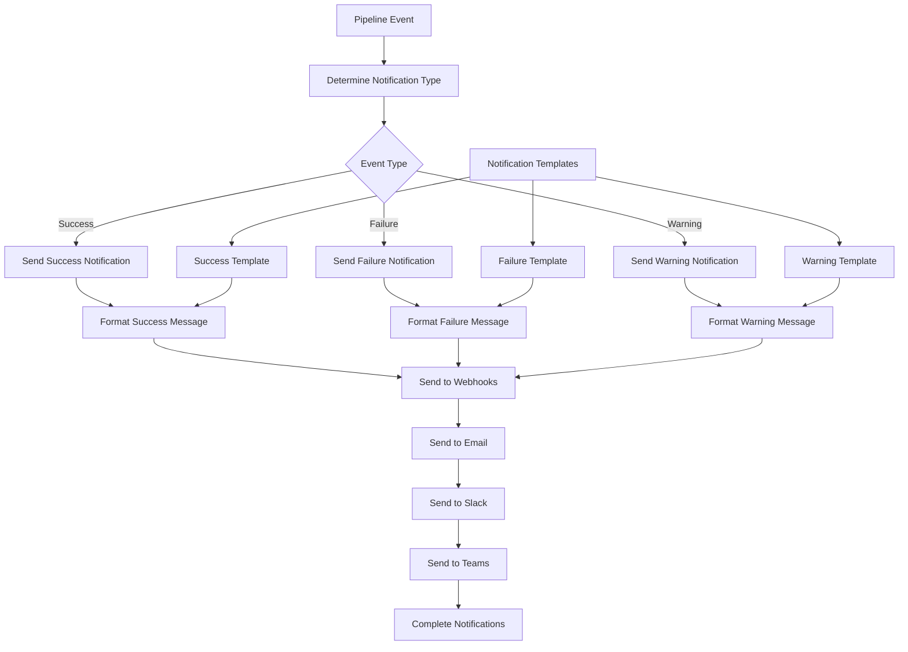

## Cache Management Flow

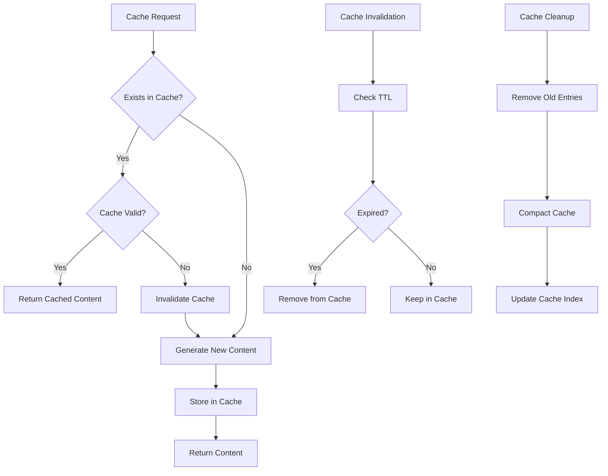

## Multi-Environment Flow

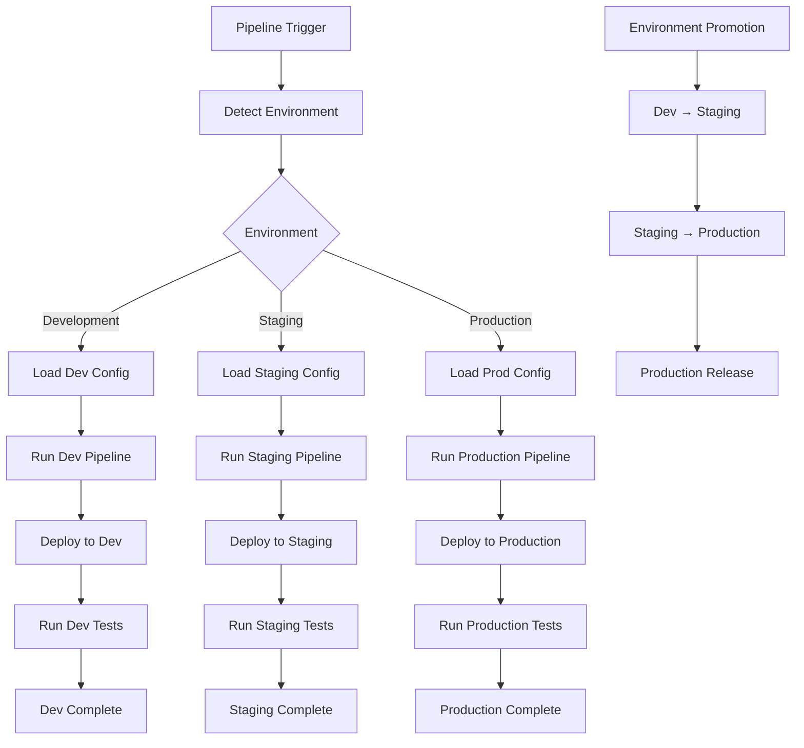

These diagrams provide a visual representation of the key workflows and processes in Syntegrity Dagger, helping users understand how the system operates and how different components interact with each other.
